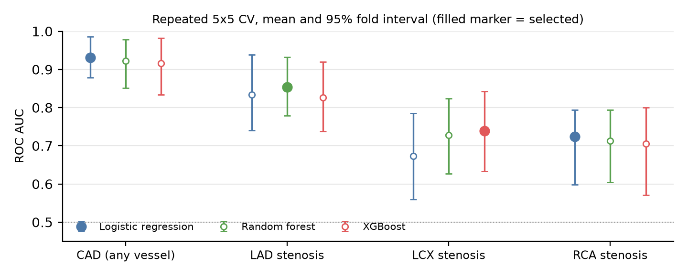
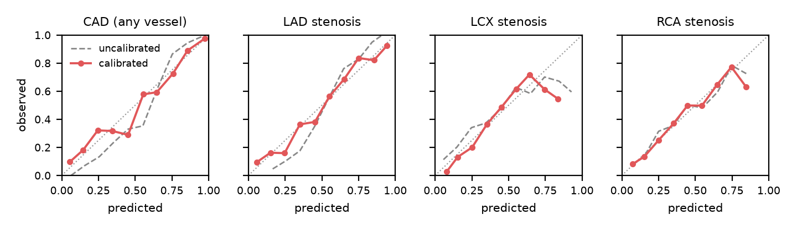
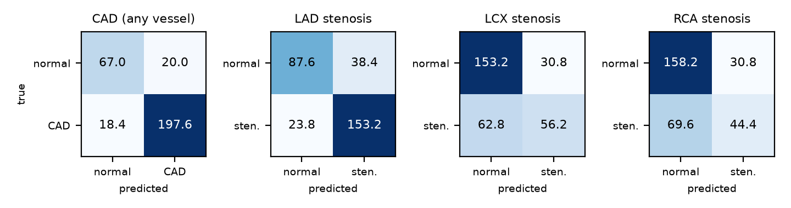
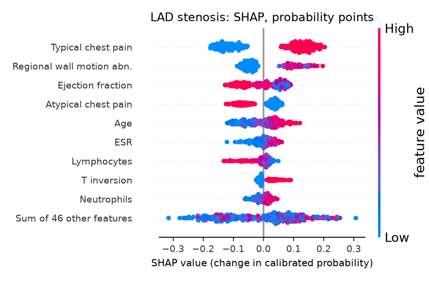
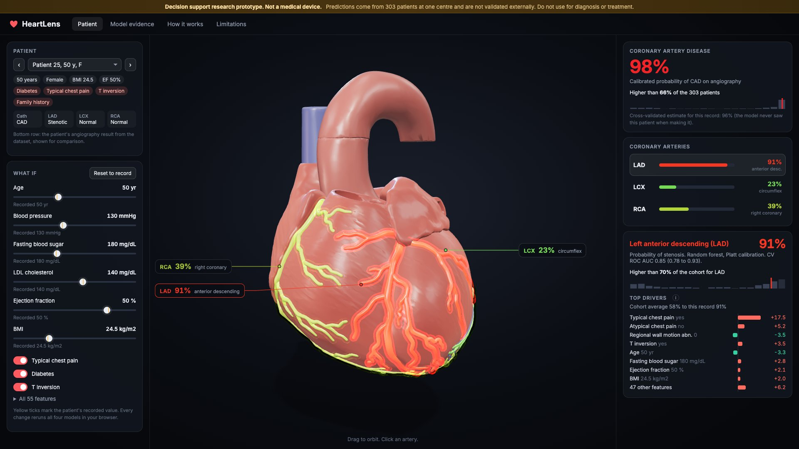

# HeartLens: coronary risk on a 3D heart

**Konstantin Saifoulline.** Multimodal AI Hackathon 2026, Track A (Cardiovascular Risk Visualization and Prediction). Code: https://github.com/Pytro001/heartlens. MIT licence.

> Decision support research prototype. Not a medical device. All results are internal cross-validation on 303 patients from one centre.

## 1. Problem

A cardiovascular risk score is a single number. Clinicians and patients have to translate it into anatomy themselves. HeartLens predicts coronary artery disease (CAD) and stenosis of each of the three main coronary arteries (left anterior descending, LAD; left circumflex, LCX; right coronary, RCA) from routine clinical data, and paints each prediction onto the matching artery of an interactive 3D heart, with a per patient explanation of what drove it. The whole model runs inside the browser, so the app is a static page with no server and no GPU.

## 2. Data

UCI Machine Learning Repository, *extension of Z-Alizadeh Sani dataset* (id 411, DOI 10.24432/C5461K, CC BY 4.0). 303 patients who underwent angiography at one centre in Tehran, Iran. 55 features after encoding: demographics, history, symptoms, examination, ECG, laboratory and echocardiography. Targets: Cath (CAD vs normal, 71% positive) and LAD, LCX, RCA stenotic vs normal (58%, 39%, 38%). No missing values. Encoding: yes/no to 1/0, sex to male = 1, bundle branch block to two indicators, valvular disease as ordinal 0 to 3; *Exertional CP* is constant and dropped.

**Leakage rule.** The four targets are strongly linked (Cath is positive when any vessel is stenotic). When one target is predicted, all four target columns are removed from the features. `tests/test_leakage.py` asserts this for every target, checks that no feature column equals any label, and checks the exported model metadata.

## 3. Method

- **Outer loop**: repeated stratified 5 fold cross-validation, 5 repeats (25 test folds), seed 42.
- **Inner loop** (inside each outer training fold only): 3 fold stratified grid search on ROC AUC. Logistic regression (standardised, L2, C in 0.03, 0.1, 0.3, 1), random forest (300 trees, depth none or 6, min leaf 1 or 3), XGBoost (200 trees, learning rate 0.05, depth 2 or 3, min child weight 1 or 3).
- **Calibration**: inside each outer training fold, 5 fold out-of-fold probabilities of the tuned model are used to fit both Platt scaling and isotonic regression; both are evaluated on the outer test fold.
- **Selection**: per target, the model family with the highest mean CV ROC AUC, then the calibration with the lower mean Brier score.
- **Metrics**: ROC AUC, PR AUC, accuracy, precision, recall, F1 (threshold 0.5) and Brier score per test fold. We report the mean over 25 folds and the 2.5 to 97.5 percentile interval of the fold estimates.
- **Final models** are refit on all 303 patients with the same tuning and calibration recipe and exported to ONNX (skl2onnx, onnxmltools). ONNX and Python outputs agree to 3.0e-07 on all patients; a Node test runs the same files in onnxruntime-web and checks the calibrated outputs.
- **Explanations**: permutation SHAP on the full calibrated pipeline (100 patient background), so values are in percentage points of the displayed probability and add up exactly to it. Precomputed for all 303 patients and 4 targets.
- `make train` takes 5.6 minutes on 4 CPU cores.

## 4. Results

**Table 1.** Selected pipeline per target, repeated 5x5 CV, mean (95% fold interval).

| Target | Model, calibration | ROC AUC | PR AUC | Accuracy | Precision | Recall | F1 | Brier |
|---|---|---|---|---|---|---|---|---|
| CAD (any vessel) | Logistic regression, Platt | 0.93 (0.88 to 0.99) | 0.97 (0.94 to 0.99) | 0.87 (0.79 to 0.96) | 0.91 (0.83 to 0.98) | 0.91 (0.85 to 1.00) | 0.91 (0.86 to 0.97) | 0.09 (0.05 to 0.14) |
| LAD stenosis | Random forest, Platt | 0.85 (0.78 to 0.93) | 0.89 (0.83 to 0.96) | 0.79 (0.72 to 0.86) | 0.80 (0.73 to 0.88) | 0.87 (0.76 to 0.95) | 0.83 (0.77 to 0.88) | 0.15 (0.11 to 0.19) |
| LCX stenosis | XGBoost, Platt | 0.74 (0.63 to 0.84) | 0.63 (0.49 to 0.77) | 0.69 (0.61 to 0.75) | 0.65 (0.52 to 0.80) | 0.47 (0.34 to 0.62) | 0.54 (0.43 to 0.65) | 0.20 (0.17 to 0.24) |
| RCA stenosis | Logistic regression, Platt | 0.72 (0.60 to 0.79) | 0.62 (0.49 to 0.73) | 0.67 (0.55 to 0.74) | 0.60 (0.36 to 0.80) | 0.39 (0.20 to 0.58) | 0.46 (0.27 to 0.60) | 0.20 (0.18 to 0.24) |

**Table 2.** Model comparison, CV ROC AUC (selected in bold).

| Target | Positive rate | Logistic regression | Random forest | XGBoost |
|---|---|---|---|---|
| CAD (any vessel) | 71% | **0.93 (0.88 to 0.99)** | 0.92 (0.85 to 0.98) | 0.92 (0.83 to 0.98) |
| LAD stenosis | 58% | 0.83 (0.74 to 0.94) | **0.85 (0.78 to 0.93)** | 0.83 (0.74 to 0.92) |
| LCX stenosis | 39% | 0.67 (0.56 to 0.79) | 0.73 (0.63 to 0.82) | **0.74 (0.63 to 0.84)** |
| RCA stenosis | 38% | **0.72 (0.60 to 0.79)** | 0.71 (0.60 to 0.79) | 0.71 (0.57 to 0.80) |

**Table 3.** Calibration, mean Brier score of the selected model family.

| Target | Brier, uncalibrated | Brier, Platt | Brier, isotonic |
|---|---|---|---|
| CAD (any vessel) | 0.102 | 0.095 | 0.096 |
| LAD stenosis | 0.164 | 0.153 | 0.155 |
| LCX stenosis | 0.205 | 0.202 | 0.208 |
| RCA stenosis | 0.203 | 0.204 | 0.211 |

*Confusion matrices: mean counts per repeat at threshold 0.5, pooled out-of-fold predictions.*

CAD is predicted well (ROC AUC around 0.93). LAD is moderately predictable. LCX and RCA are the hardest targets: their AUCs around 0.72 to 0.74 are clearly better than chance but recall at 0.5 is low, so a negative vessel prediction should not be read as reassurance. We show this rather than tune thresholds to make the table look better.

## 5. Interpretability and the app

Most important features by mean absolute SHAP value:

- **CAD (any vessel)**: typical chest pain, atypical chest pain, age, hypertension, diabetes.
- **LAD stenosis**: typical chest pain, regional wall motion abn., ejection fraction, atypical chest pain, age.
- **LCX stenosis**: age, typical chest pain, creatinine, triglycerides, platelets.
- **RCA stenosis**: diabetes, age, typical chest pain, male sex, dyspnea.

Typical chest pain dominates CAD and LAD, which matches clinical intuition; regional wall motion abnormality and ejection fraction (echo findings of prior ischemia) rank high for LAD.

The app (Vite, TypeScript, Three.js, onnxruntime-web) loads a BodyParts3D heart (heart wall, aorta, veins and the LAD, LCX and RCA trees, CC BY-SA 2.1 JP). Each artery is coloured on a green to red ramp by its calibrated probability with a soft glow, and the overall CAD probability subtly tints the muscle. Clicking an artery opens its card: probability, model and CV AUC, cohort percentile among all 303 patients and the SHAP waterfall for the patient. What-if sliders and toggles (age, blood pressure, fasting blood sugar, LDL, ejection fraction, BMI, typical chest pain, diabetes, T inversion) and an editable form for all 55 features rerun all four models on every change, well under 200 ms (median under 1 ms for a full batch in our test). For edited rows the app shows an *approximate contribution*: each edited feature is set back to the recorded value one at a time and the change in probability is shown. The UI labels this as approximate and explains it in a tooltip; it is not a SHAP value.

## 6. Limitations

- 303 patients, one centre in Iran, a referral population (71% CAD). No external validation; intervals reflect fold to fold spread only.
- Vessel labels say whether an artery is stenotic, not where. The whole vessel is coloured.
- What-if results show model behaviour, not causal effects. Linked features (weight, BMI) are edited independently.
- Dataset patients are in the final training set, so their live probabilities are in-sample; the app also shows the out-of-fold estimate.
- The heart is a generic reference anatomy, not the patient's.
- Not a medical device; not for diagnosis or treatment.

**Attribution.** Z-Alizadeh Sani extension dataset: R. Alizadehsani, M. Roshanzamir, Z. Sani, UCI Machine Learning Repository, CC BY 4.0. BodyParts3D, Copyright 2008 Life Science Integrated Database Center, CC BY-SA 2.1 Japan (via the K. M. Moerman GitHub mirror).
